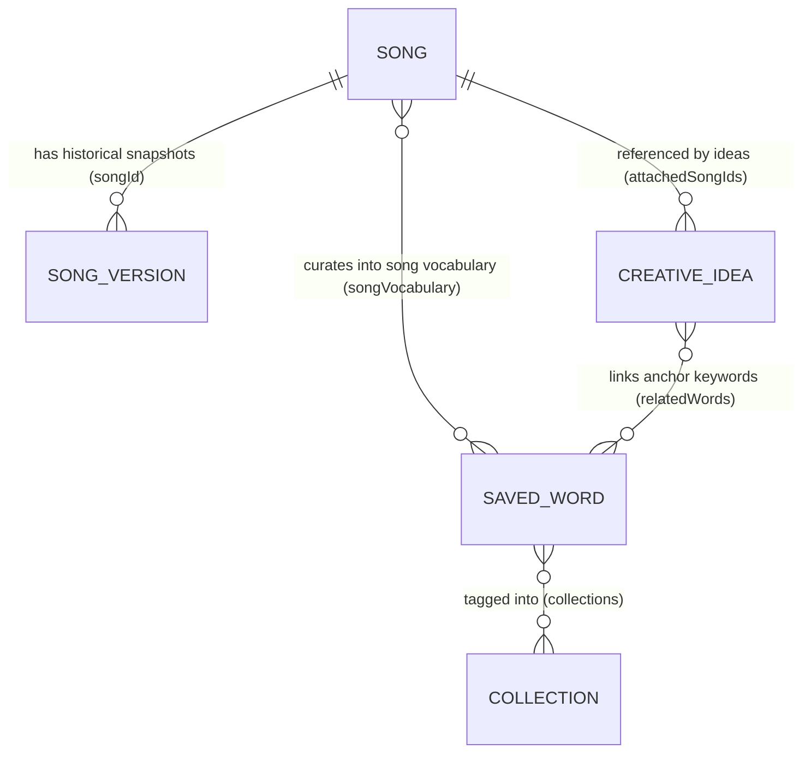

# BHASHA — CANONICAL DATA MODEL SPECIFICATION (v2.0.0)

---

## 1. Overview & Principles

BHASHA adheres to strict local-first data principles:
1. **Canonical vs. Derived Separation**: Only primary creative work and explicit configuration are persisted. Everything computable is derived dynamically.
2. **Lyric Immutability by System**: System normalization, migration, or validation engines must **never** mutate lyric line content. Lyrics are sacred artist output.
3. **Idempotent Normalization**: For any project state $P$, applying normalization repeatedly produces an identical result: $\text{normalize}(\text{normalize}(P)) = \text{normalize}(P)$.
4. **Deterministic Serialization**: JSON exports use consistent key ordering and ISO-8601 UTC timestamps.

---

## 2. Canonical Entities Specification

### A. Song Project (`Song`)
Represents an individual songwriting project.

```typescript
export interface Song {
  id: string;                         // UUID or formatted string: `song-${timestamp}-${rand}`
  title: string;                      // Display title (e.g. "KAALI RAAT")
  content: string;                    // Raw lyrics containing section headers [Verse 1], [Hook], etc.
  bpm: number;                        // Tempo in beats per minute (40 to 250, default 92)
  key: string;                        // Musical key (e.g. "Am", "G#m", "C")
  timeSignature: string;              // Time signature ("4/4", "3/4", "6/8", "7/8", default "4/4")
  status: SongStatus;                 // 'DRAFT' | 'IN PROGRESS' | 'COMPLETE' | 'ARCHIVED'
  revision?: number;                  // Monotonic mutation counter (starts at 1)
  genre?: string;                     // Optional genre classification (e.g. "Boom Bap", "Trap")
  mood?: string;                      // Creative mood (e.g. "Dark", "Melancholic", "Energetic")
  tags: string[];                     // Array of custom tags
  notes?: string;                     // Multi-paragraph creative concept notes
  sectionNotes?: Record<string, string>; // Keyed by section title (e.g. { "Verse 1": "Soft whisper" })
  songVocabulary?: string[];          // Curated Devanagari words linked to this track
  scratchpadNotes?: string;           // Historical quick scratchpad notes
  stashedRhymes?: string[];           // Historical quick rhyme words
  pinnedPromptId?: string;            // Optional creative prompt ID
  createdAt: string;                  // ISO-8601 UTC timestamp
  updatedAt: string;                  // ISO-8601 UTC timestamp
}
```

### B. Song Version Snapshot (`SongVersion`)
Represents an immutable historical snapshot of a song at a given milestone.

```typescript
export interface SongVersion {
  id: string;                         // Unique snapshot ID: `ver-${timestamp}-${rand}`
  songId: string;                     // Foreign key referencing parent Song.id
  label: string;                      // User-facing name (e.g. "Hook Polish", "Before restore...")
  timestamp: string;                  // ISO-8601 UTC timestamp when snapshot was captured
  content: string;                    // Immutable lyrics state at snapshot time
  notes?: string;                     // Song notes at snapshot time
  sectionNotes?: Record<string, string>; // Section notes at snapshot time
  songVocabulary?: string[];          // Song vocabulary bank at snapshot time
  bpm?: number;                       // Tempo at snapshot time
  key?: string;                       // Musical key at snapshot time
  tags?: string[];                    // Tags at snapshot time
  isAutoSafetySnapshot?: boolean;     // True if captured automatically before a version restore
}
```

### C. Saved Lexicon Word (`SavedWord`)
Represents a curated word in the artist's vocabulary bank.

```typescript
export interface SavedWord {
  id: string;                         // Canonical ID (e.g. "fanaa", "word-${timestamp}-${rand}")
  devanagari: string;                 // Primary Devanagari representation (e.g. "फ़ना")
  urdu?: string;                      // Optional Nastaliq Urdu script
  roman: string;                      // Normalized Roman Hindi transliteration (e.g. "fanaa")
  meaning: string;                    // English definition / lyrical translation
  pronunciation?: string;             // IPA phonetic transcription (e.g. "/fəˈnaː/")
  personalNote?: string;              // Writer's private notes on usage, rhyme targets, rhymes
  tags: string[];                     // Emotion, register, theme tags
  collections?: string[];             // Array of collection names (e.g. ["SPIRITUAL", "NIGHT"])
  savedAt: string;                    // ISO-8601 UTC timestamp
  sourceSongId?: string;              // Optional Song ID where word was discovered
  sourceContext?: string;             // Optional lyric line where word was written
  perfectRhymes?: string[];           // Cached perfect rhyme references
  strongRhymes?: string[];            // Cached strong rhyme references
  nearRhymes?: string[];              // Cached near rhyme references
  relatedImagery?: string[];          // Sensory imagery associations
}
```

### D. Creative Idea (`CreativeIdea`)
Represents a private couplet, punchline, sensory contrast, or voice memo transcript.

```typescript
export type IdeaType = 'CONCEPT' | 'IMAGE' | 'EMOTION' | 'CONTRAST' | 'SCENE' | 'PHRASE' | 'THEME' | 'COUPLET';
export type IdeaStatus = 'UNUSED' | 'IN PROGRESS' | 'USED';

export interface CreativeIdea {
  id: string;                         // Unique ID: `idea-${timestamp}-${rand}`
  title: string;                      // Summary headline or title
  type: IdeaType;                     // Category of creative seed
  content: string;                    // Raw text, couplet, or transcription
  tags: string[];                     // Associative tags
  status: IdeaStatus;                 // Lifecycle status
  attachedSongIds?: string[];         // Foreign keys to Song.id
  relatedWords?: string[];            // Devanagari words linked to this idea
  createdAt: string;                  // ISO-8601 UTC timestamp
  updatedAt: string;                  // ISO-8601 UTC timestamp
}
```

### E. Project Backup Container (`BhashaProjectBackup`)
Single-file backup schema for exporting and importing complete artist workspaces.

```typescript
export interface BhashaProjectBackup {
  schemaVersion: number;              // Current: 2 (Backwards-compatible with 1)
  exportedAt: string;                 // ISO-8601 UTC timestamp
  bhashaVersion: string;              // Application version (e.g. "1.0.0")
  generator?: string;                 // "BHASHA Songwriter OS"
  songs: Song[];
  versions: SongVersion[];
  lexicon: SavedWord[];
  collections: string[];
  ideas: CreativeIdea[];
  recentWords?: string[];
  preferences?: AppPreferences;
}
```

---

## 3. Relationships & Foreign Key Topology



- **Delete Song**: Deletes associated `SongVersion` snapshots. Cleans dangling IDs in `CreativeIdea.attachedSongIds` without deleting the ideas. Preserves `SavedWord` vocabulary in personal lexicon.
- **Delete SavedWord**: Removes word from personal lexicon and cleans dangling references in `Song.songVocabulary` and `CreativeIdea.relatedWords`.
- **Delete Collection**: Deletes collection name and decouples collection tag from `SavedWord.collections` without deleting the underlying words.

---

## 4. Timestamps & Timezones

- All timestamps are ISO-8601 extended UTC strings (e.g. `2026-09-18T11:45:00.000Z`).
- Non-UTC timestamps are parsed safely and normalized to ISO-8601 UTC upon import.
- Sorting operations use deterministic numeric epoch conversions: `new Date(ts).getTime()`.

---

## 5. Schema Migration Roadmap

- **v1 $\to$ v2**:
  1. Status normalization (`'Draft'` $\to$ `'DRAFT'`, `'In Progress'` $\to$ `'IN PROGRESS'`).
  2. Revision initialization (`song.revision = song.revision || 1`).
  3. Ensures all required arrays (`tags`, `songVocabulary`, `attachedSongIds`, `relatedWords`) are defined.
  4. Preserves arbitrary unknown properties for forward-compatible user data safety.
